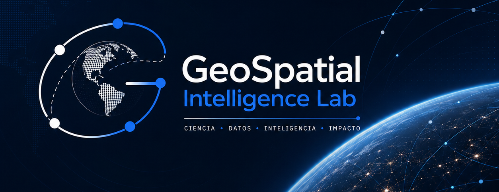

# GeoSpatial Intelligence Lab

### Transforming Geospatial Data into Scientific Intelligence

**GeoSpatial Intelligence Lab (GIL)** is an independent applied research laboratory dedicated to advancing **Earth Observation, GeoAI, Scientific Computing, and Decision Intelligence** through reproducible research, open-source technologies, and mathematical innovation.

Our mission is to transform geospatial data into scientific knowledge that supports environmental understanding, spatial analysis, and evidence-based decision-making.

---

# Mission

To develop reproducible scientific methodologies and intelligent geospatial technologies that integrate applied mathematics, satellite remote sensing, artificial intelligence, and spatial analytics to address real-world environmental and territorial challenges.

---

# Vision

To become an internationally recognized independent research laboratory developing innovative and open scientific solutions at the intersection of Earth Observation, Artificial Intelligence, and Applied Mathematics.

---

# Research Areas

## 🌍 Earth Observation

Developing methodologies for environmental monitoring using satellite imagery, remote sensing, and climate data.

---

## 🛰 Orbital Systems

Scientific computing for satellite orbit propagation, orbital mechanics, and space-based Earth observation.

---

## 🤖 GeoAI

Applying machine learning and artificial intelligence to extract knowledge from geospatial and environmental data.

---

## 📊 Decision Intelligence

Transforming spatial information into reproducible analytical tools that support environmental and territorial decision-making.

---

# Research Portfolio

## 🛰 Satellite Orbit Analysis over Colombia

**Status:** Completed Research

Scientific platform for satellite orbit propagation, visualization, and analysis using Keplerian models, TLE data, and geospatial visualization.

---

## 🌎 EcoPrediction Colombia

**Status:** Ongoing Research

Earth Observation framework integrating satellite imagery, climate variables, and machine learning for ecosystem monitoring.

---

## 🏡 Vereda Inteligente

**Status:** Operational Platform

Spatial Decision Support System designed to assist territorial management through geospatial analytics and data-driven decision-making.

---

# Research Philosophy

We believe that mathematics becomes truly valuable when it transforms data into knowledge, and knowledge into better decisions.

Every project developed within GeoSpatial Intelligence Lab is guided by four core principles:

- Scientific rigor
- Reproducibility
- Open Science
- Real-world impact

---

# Core Technologies

### Programming

- Python
- SQL
- R

### Scientific Computing

- NumPy
- SciPy
- Pandas

### Earth Observation

- Google Earth Engine
- Sentinel
- Landsat

### Machine Learning

- Scikit-learn
- TensorFlow
- PyTorch

### Geospatial Analytics

- GeoPandas
- Rasterio
- Shapely
- Folium

### Data Visualization

- Streamlit
- Plotly
- Matplotlib

---

# Current Roadmap

- Expand the GeoSpatial Intelligence Lab research portfolio.
- Publish EcoPrediction Colombia.
- Consolidate Vereda Inteligente as an operational platform.
- Develop reusable open-source scientific frameworks.
- Publish scientific articles and technical reports.

---

# Open Science

GeoSpatial Intelligence Lab promotes reproducible research, transparent methodologies, and open-source scientific software whenever possible to encourage collaboration and accelerate scientific discovery.

---

# Repository Structure

```text
geospatial-intelligence-lab/

├── README.md
├── LICENSE
├── docs/
├── assets/
└── roadmap/
```

---

# Collaborate

We welcome collaborations with researchers, universities, environmental organizations, and technology partners interested in Earth Observation, GeoAI, and Applied Mathematics.

---

## Contact

**GeoSpatial Intelligence Lab**

🌍 Earth Observation

🛰 Scientific Computing

🤖 GeoAI

📊 Decision Intelligence
